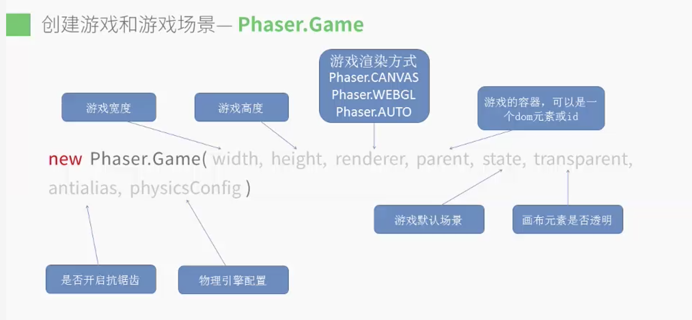
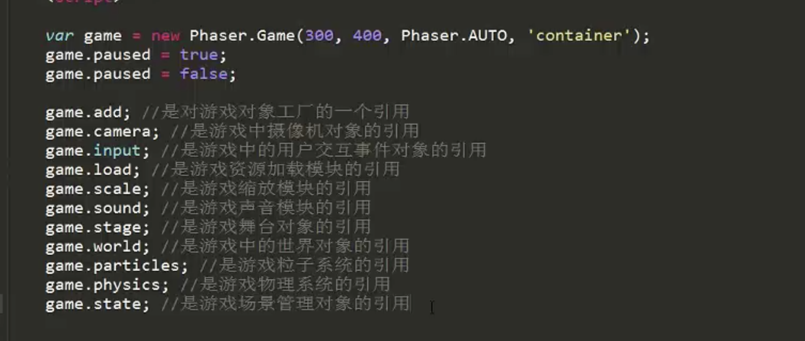
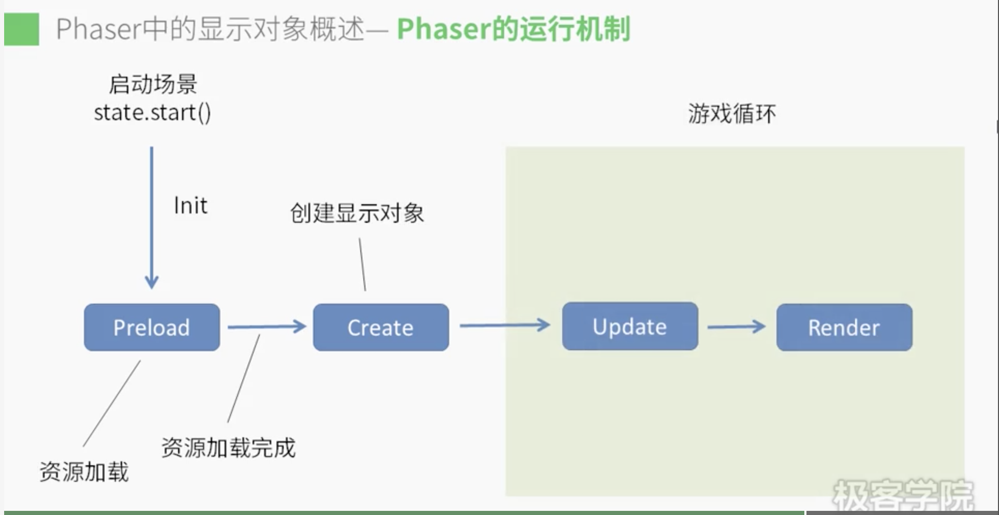
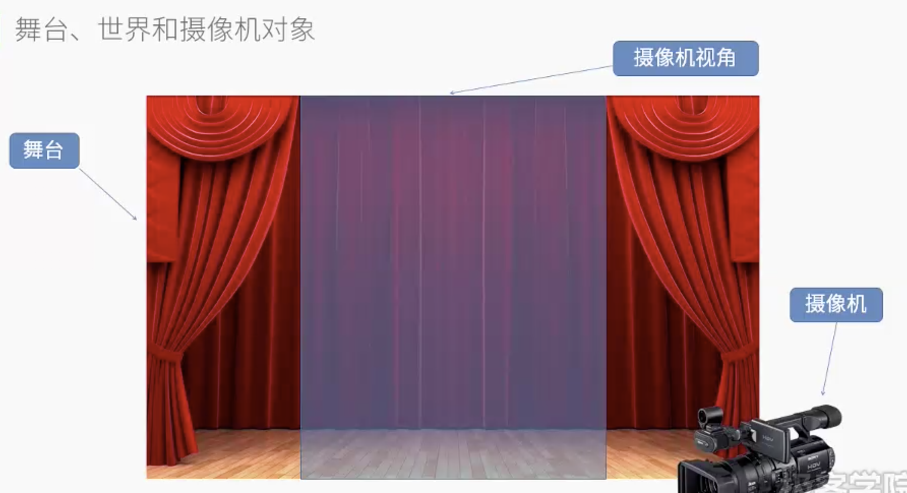
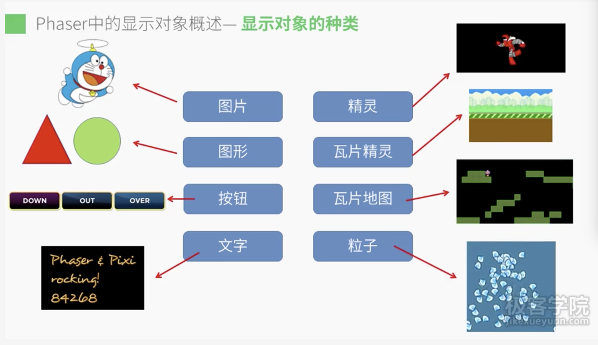

# Phaser.js

## 一款跨平台的HTML游戏开发引擎。

* 桌面端 IE9+、Firefox、Chrome & Safari…，
* 移动端 ios5+ 的 Safari、安卓2.2+ 的 Stock Browser & Chrome
* CocoonJS加速并打包成原生应用
---

### 特性：
* 支持Canvas和WebGL两种渲染模式（pixi.js）
* 简单易用的资源加载系统
* 完善的动画系统
* 丰富的用户交互事件
* 支持html5 Audio & Web Audio 两种声音模式
* 强大的物理引擎

---
## Phaser.Game

---
## Phaser.State／场景（游戏的区块）

---
## 舞台、世界和摄像机对象

----
点击这里[说明示例](stage.html)生动说明

---
## 游戏显示对象

